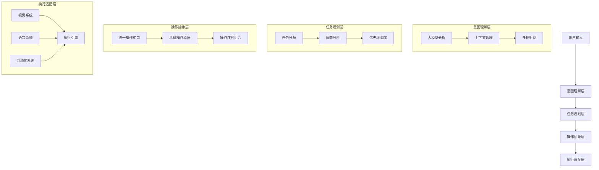

# SmartAssistant 开发路线图

## 系统总体架构

## v0.1.x - 项目基础建设
- [x] 项目初始化
  - [x] 基础框架搭建
  - [x] 开发文档体系建立
  - [x] 代码规范制定
- [x] 多语言模型支持
  - [x] OpenAI GPT-3.5/4 集成
  - [x] Claude 集成
  - [x] QianWen 集成
- [x] 基础用户界面
  - [x] 聊天对话界面
  - [x] 消息气泡样式
- [x] 命令执行系统 1.0
  - [x] 基础框架搭建
    - [x] TaskExecutionService 基础实现
    - [x] AutomationService 基础实现
    - [x] PythonScriptExecutor 实现
    - [x] 任务生命周期管理
  - [-] 任务分类与路由（待优化）
    - [-] 简单的关键词匹配分类
    - [-] 基础任务路由逻辑
  - [-] 自动化能力（待重构）
    - [-] 初步的执行能力
    - [-] 分散的实现方案
  - [x] 系统集成
    - [x] Python运行时集成
    - [x] 浏览器驱动集成
    - [x] 日志系统集成
  - [x] 错误处理机制
    - [x] 任务验证
    - [x] 异常捕获和处理
    - [x] 错误日志记录
- [ ] 质量保证体系
  - [ ] 单元测试框架
    - [ ] xUnit配置
    - [ ] Moq集成
    - [ ] FluentAssertions配置
    - [ ] Coverlet覆盖率工具
  - [ ] 测试规范制定
    - [ ] 测试命名规范
    - [ ] 测试组织结构
    - [ ] 测试数据管理
  - [ ] CI/CD配置
    - [ ] GitHub Actions工作流
    - [ ] 自动化测试运行
    - [ ] 代码质量检查
    - [ ] 覆盖率报告生成
  - [ ] 代码质量工具
    - [ ] StyleCop配置
    - [ ] SonarCloud集成
    - [ ] ReSharper配置

## v0.2.0 - 智能交互基础
- [ ] 命令执行系统 2.0
  - [ ] 基于大模型的意图理解
    - [ ] 集成大模型进行意图分析
    - [ ] 上下文理解与状态跟踪
    - [ ] 多轮对话支持
  - [ ] 任务分解与规划
    - [ ] 任务拆解为基本操作序列
    - [ ] 任务依赖关系管理
    - [ ] 任务优先级调度
  - [ ] 操作抽象层
    - [ ] 统一操作接口定义
    - [ ] 基础操作原语实现（点击、输入、滚动等）
    - [ ] 操作序列组合机制
  - [ ] 基础视觉系统
    - [ ] 屏幕截图与OCR
    - [ ] 基础UI元素定位
    - [ ] 简单图像匹配
    - [ ] 基础视觉反馈
  - [ ] 执行引擎优化
    - [ ] 任务执行状态管理
    - [ ] 基础错误恢复机制
    - [ ] 执行日志优化
  - [ ] 开发工具支持
    - [ ] 调试工具改进
    - [ ] 任务执行可视化
    - [ ] 开发文档完善
- [ ] 基础语音交互
  - [ ] 语音识别集成
    - [ ] 实时语音输入
    - [ ] 基础语音指令识别
    - [ ] 多语言支持
  - [ ] 语音合成
    - [ ] 基础TTS实现
    - [ ] 语音播报功能
    - [ ] 语速调节
  - [ ] 语音交互流程
    - [ ] 唤醒词识别
    - [ ] 语音指令处理
    - [ ] 基础交互反馈
- [ ] 对话历史管理
  - [ ] 本地存储对话历史
  - [ ] 对话导出功能
- [ ] UI优化
  - [ ] 深色模式支持
  - [ ] 消息气泡样式优化
  - [ ] 代码块语法高亮

## v0.3.0 - 高级智能特性
- [ ] 命令执行系统 3.0
  - [ ] 高级视觉理解
    - [ ] 深度视觉语义理解
    - [ ] 动态UI元素追踪
    - [ ] 复杂场景识别
    - [ ] 视觉上下文理解
  - [ ] 智能操作系统
    - [ ] 键鼠模拟引擎
    - [ ] 操作录制与回放
    - [ ] 操作模式学习
  - [ ] 高级错误处理
    - [ ] 智能错误诊断
    - [ ] 自动错误恢复
    - [ ] 异常情况学习
  - [ ] 任务优化系统
    - [ ] 操作序列优化
    - [ ] 性能分析与优化
    - [ ] 资源使用优化
  - [ ] 学习与适应
    - [ ] 用户习惯学习
    - [ ] 操作模式挖掘
    - [ ] 自动化建议
- [ ] 高级语音交互
  - [ ] 语音情感识别
    - [ ] 语气分析
    - [ ] 情绪识别
    - [ ] 说话风格识别
  - [ ] 智能语音合成
    - [ ] 情感语音合成
    - [ ] 自然语气调节
    - [ ] 多角色语音
  - [ ] 上下文语音交互
    - [ ] 连续对话理解
    - [ ] 场景感知响应
    - [ ] 智能打断处理
- [ ] 自然语言处理优化
  - [ ] 中文分词优化
  - [ ] 同义词理解

## v0.4.0 - 高级功能
- [ ] 插件系统
  - [ ] 插件框架开发
  - [ ] 插件市场
  - [ ] 插件管理
- [ ] 多设备同步
  - [ ] 云端存储
  - [ ] 设备间同步
  - [ ] 实时更新
- [ ] 自动化任务
  - [ ] 任务录制和回放
  - [ ] 定时任务设置
  - [ ] 条件触发任务

## v0.5.0 - 生产力工具
- [ ] 代码助手
  - [ ] 代码补全
  - [ ] 代码重构建议
  - [ ] 文档生成
- [ ] 知识管理
  - [ ] 笔记功能
  - [ ] 知识图谱
  - [ ] 资料整理
- [ ] 工作流集成
  - [ ] 项目管理工具集成
  - [ ] 日历和提醒功能
  - [ ] 邮件处理

## v1.0.0 - 正式版本
- [ ] 性能优化
  - [ ] 启动速度优化
  - [ ] 内存使用优化
  - [ ] 响应速度提升
- [ ] 安全性增强
  - [ ] 数据加密
  - [ ] 权限管理
  - [ ] 隐私保护
- [ ] 多平台支持
  - [ ] Windows优化
  - [ ] macOS支持
  - [ ] Linux支持

## 未来展望
- 多模态交互（图像识别、视频分析）
- AR/VR集成
- 边缘计算支持
- 多设备协同
- 自定义模型训练

注意：此路线图会根据用户反馈和实际开发情况进行调整。每个版本的具体功能可能会有所变化。
