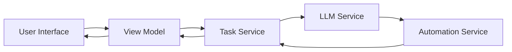
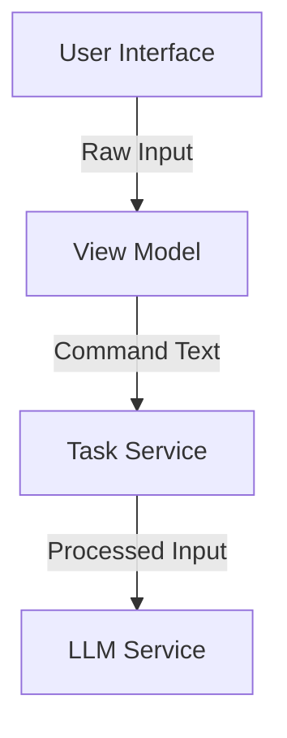
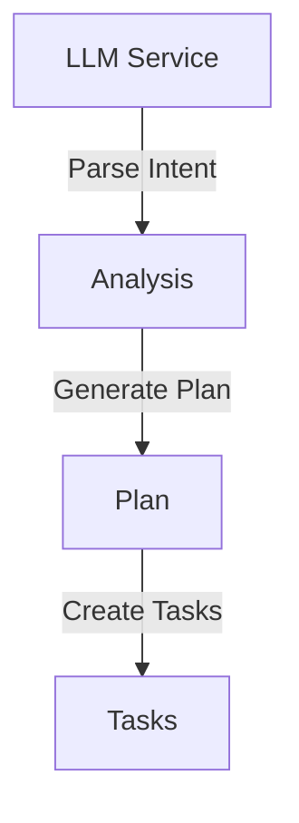
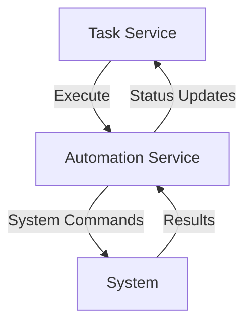
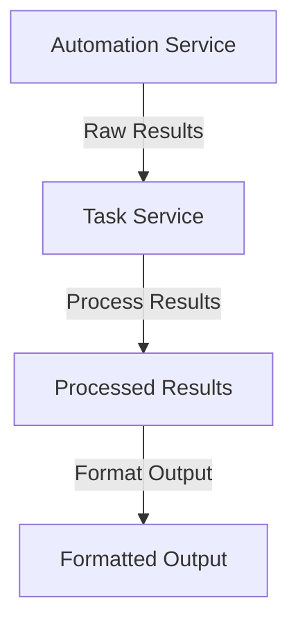
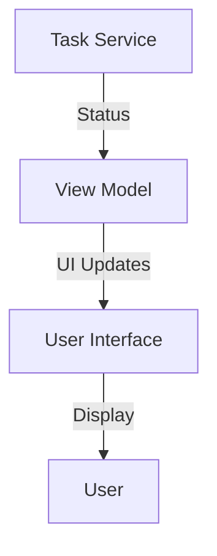
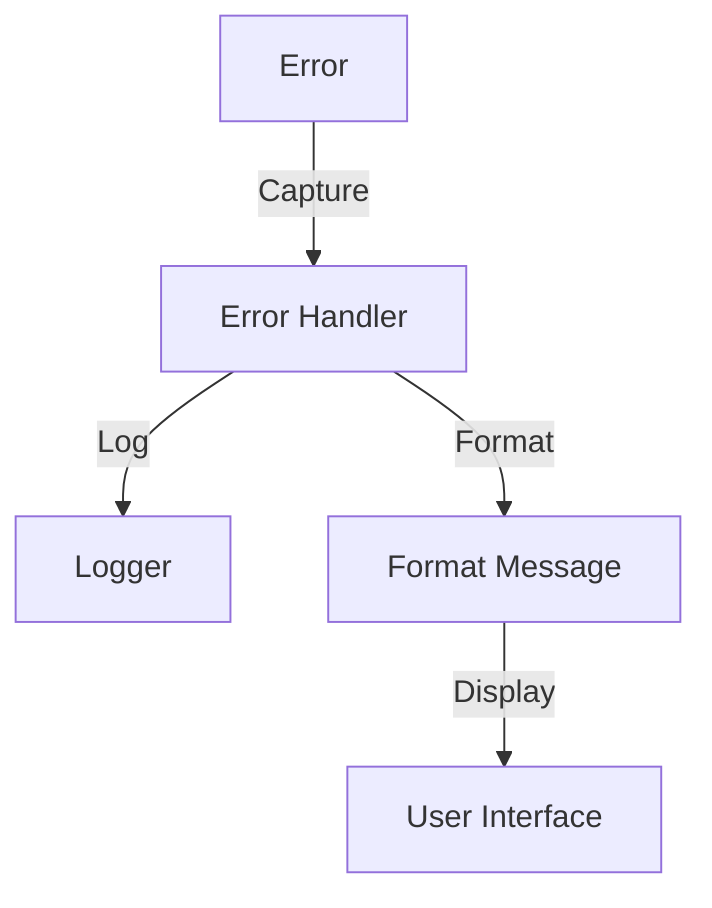
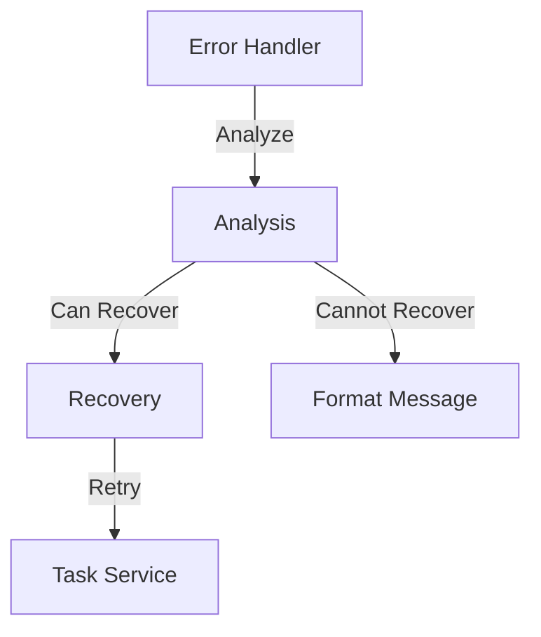
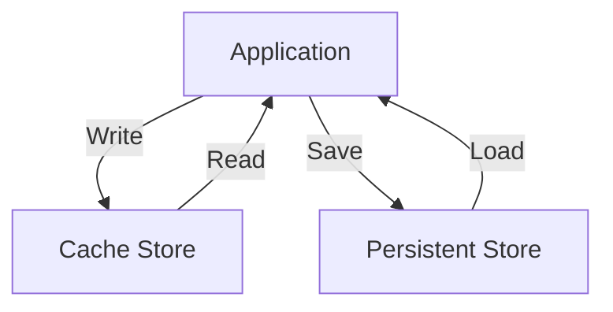

# Data Flow

This document describes the flow of data through the SmartAssistant system.

## Overview

SmartAssistant processes data through several key stages:



## Input Processing Flow

### 1. User Input Capture


- User enters text or command
- Input is captured by UI controls
- View Model processes and validates input
- Task Service receives formatted command

### 2. LLM Processing


- LLM analyzes user intent
- Generates execution plan
- Breaks down into subtasks
- Validates task sequence

### 3. Task Execution


- Tasks converted to system commands
- Commands executed sequentially
- Results captured and processed
- Status updates provided

## Response Flow

### 1. Result Collection


- Command execution results gathered
- Results processed and validated
- Output formatted for display

### 2. Status Updates


- Real-time status updates
- Progress indicators
- Error notifications
- Completion status

## Data Types

### Input Data
```typescript
interface UserInput {
    rawText: string;
    timestamp: DateTime;
    context?: object;
}
```

### LLM Data
```typescript
interface LLMRequest {
    input: string;
    parameters: {
        temperature: number;
        maxTokens: number;
    };
}

interface LLMResponse {
    content: string;
    confidence: number;
    metadata: object;
}
```

### Task Data
```typescript
interface Task {
    id: string;
    type: TaskType;
    status: TaskStatus;
    input: object;
    output?: object;
    error?: string;
}
```

### Command Data
```typescript
interface Command {
    name: string;
    arguments: string[];
    workingDirectory?: string;
    environment?: Record<string, string>;
}
```

## State Management

### View Model State
```typescript
interface ViewModelState {
    input: string;
    isProcessing: boolean;
    currentTask?: Task;
    messages: Message[];
    error?: string;
}
```

### Task Service State
```typescript
interface TaskServiceState {
    activeTasks: Map<string, Task>;
    taskQueue: Queue<Task>;
    taskHistory: Task[];
}
```

## Error Flow

### Error Handling


- Errors captured at each stage
- Logged for debugging
- User-friendly messages generated
- Appropriate UI updates

### Recovery Flow


- Error analysis
- Recovery attempt if possible
- Graceful degradation
- User notification

## Data Persistence

### Storage Types
1. **Temporary Storage**
   - In-memory cache
   - Session state
   - View model state

2. **Persistent Storage**
   - Configuration files
   - User preferences
   - Task history

### Storage Flow


## Related Documentation
- [System Architecture](./system-architecture.md)
- [API Documentation](../api/core-services.md)
- [Development Guidelines](../guides/development-guidelines.md)
