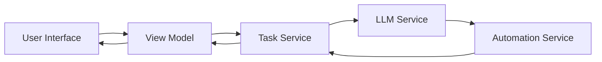
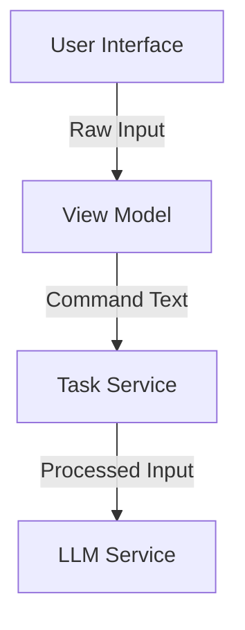
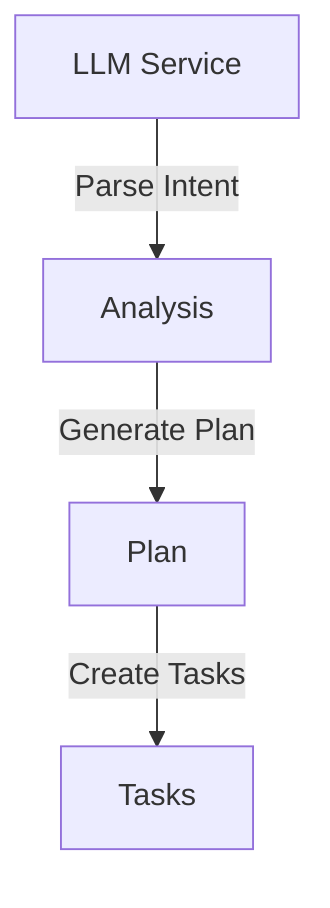
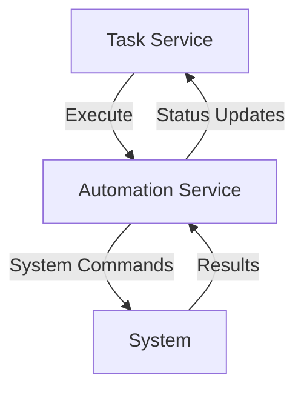
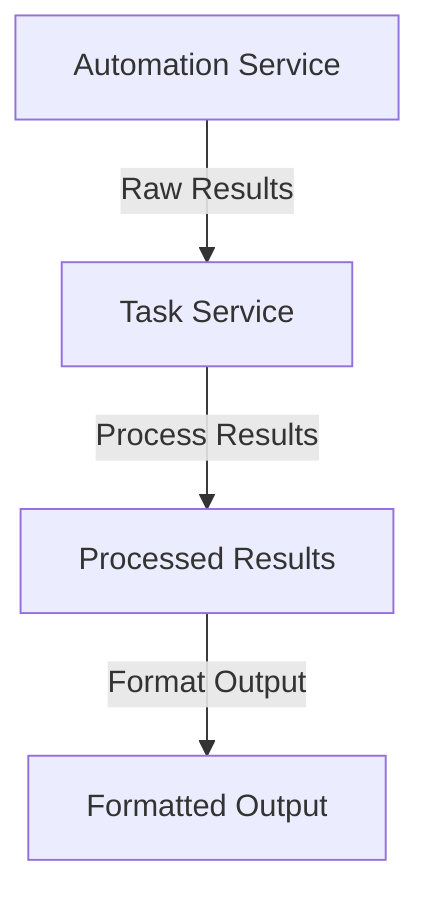
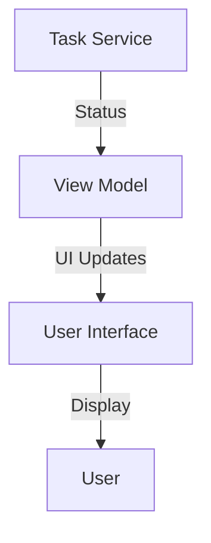
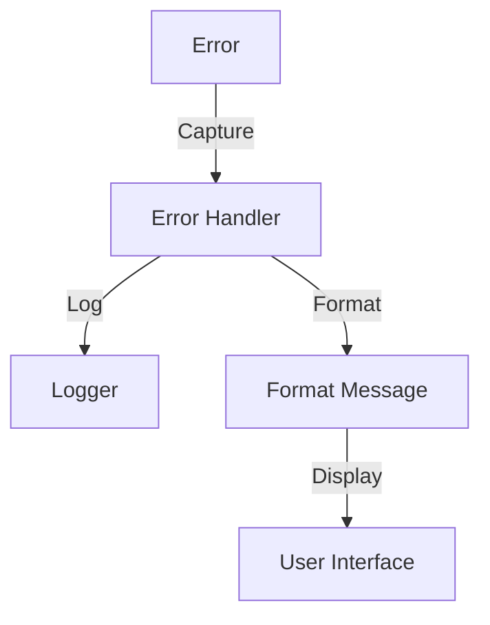
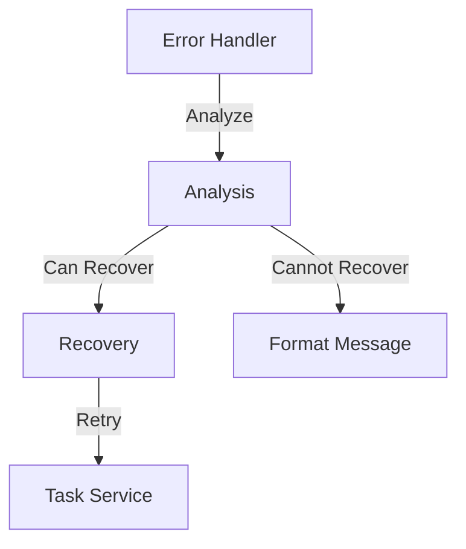
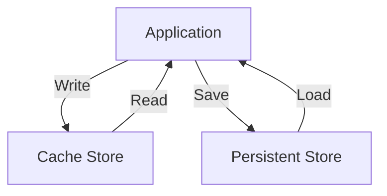

# Data Flow | 数据流

This document describes the flow of data through the SmartAssistant system.
本文档描述了 SmartAssistant 系统中的数据流。

## Overview | 概述

SmartAssistant processes data through several key stages:
SmartAssistant 通过以下几个关键阶段处理数据：



## Input Processing Flow | 输入处理流程

### 1. User Input Capture | 用户输入捕获


- User enters text or command
  用户输入文本或命令
- Input is captured by UI controls
  UI 控件捕获输入
- View Model processes and validates input
  视图模型处理并验证输入
- Task Service receives formatted command
  任务服务接收格式化的命令

### 2. LLM Processing | LLM 处理


- LLM analyzes user intent
  LLM 分析用户意图
- Generates execution plan
  生成执行计划
- Breaks down into subtasks
  分解为子任务
- Validates task sequence
  验证任务序列

### 3. Task Execution | 任务执行


- Tasks converted to system commands
  任务转换为系统命令
- Commands executed sequentially
  按顺序执行命令
- Results captured and processed
  捕获并处理结果
- Status updates provided
  提供状态更新

## Response Flow | 响应流程

### 1. Result Collection | 结果收集


- Command execution results gathered
  收集命令执行结果
- Results processed and validated
  处理并验证结果
- Output formatted for display
  格式化输出以供显示

### 2. Status Updates | 状态更新


- Real-time status updates
  实时状态更新
- Progress indicators
  进度指示器
- Error notifications
  错误通知
- Completion status
  完成状态

## Data Types | 数据类型

### Input Data | 输入数据
```typescript
interface UserInput {
    rawText: string;      // 原始文本
    timestamp: DateTime;   // 时间戳
    context?: object;     // 上下文（可选）
}
```

### LLM Data | LLM 数据
```typescript
interface LLMRequest {
    input: string;
    parameters: {
        temperature: number;
        maxTokens: number;
    };
}

interface LLMResponse {
    content: string;
    confidence: number;
    metadata: object;
}
```

### Task Data | 任务数据
```typescript
interface Task {
    id: string;
    type: TaskType;
    status: TaskStatus;
    input: object;
    output?: object;
    error?: string;
}
```

### Command Data | 命令数据
```typescript
interface Command {
    name: string;
    arguments: string[];
    workingDirectory?: string;
    environment?: Record<string, string>;
}
```

## State Management | 状态管理

### View Model State | 视图模型状态
```typescript
interface ViewModelState {
    input: string;
    isProcessing: boolean;
    currentTask?: Task;
    messages: Message[];
    error?: string;
}
```

### Task Service State | 任务服务状态
```typescript
interface TaskServiceState {
    activeTasks: Map<string, Task>;
    taskQueue: Queue<Task>;
    taskHistory: Task[];
}
```

## Error Flow | 错误流程

### Error Handling | 错误处理


- Errors captured at each stage
  捕获每个阶段的错误
- Logged for debugging
  日志记录用于调试
- User-friendly messages generated
  生成用户友好的消息
- Appropriate UI updates
  适当的 UI 更新

### Recovery Flow | 恢复流程


- Error analysis
  错误分析
- Recovery attempt if possible
  尝试恢复如果可能
- Graceful degradation
  优雅降级
- User notification
  用户通知

## Data Persistence | 数据持久化

### Storage Types | 存储类型
1. **Temporary Storage**
   - In-memory cache
   - Session state
   - View model state

2. **Persistent Storage**
   - Configuration files
   - User preferences
   - Task history

### Storage Flow | 存储流程


## Related Documentation | 相关文档
- [System Architecture | 系统架构](/docs/architecture/system-architecture.md)
- [API Documentation | API 文档](/docs/api/core-services.md)
- [Development Guidelines | 开发指南](/docs/guides/development-guidelines.md)
